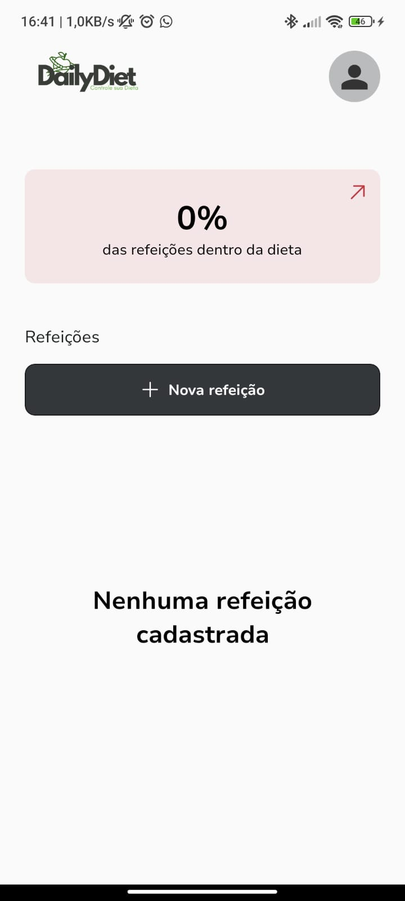
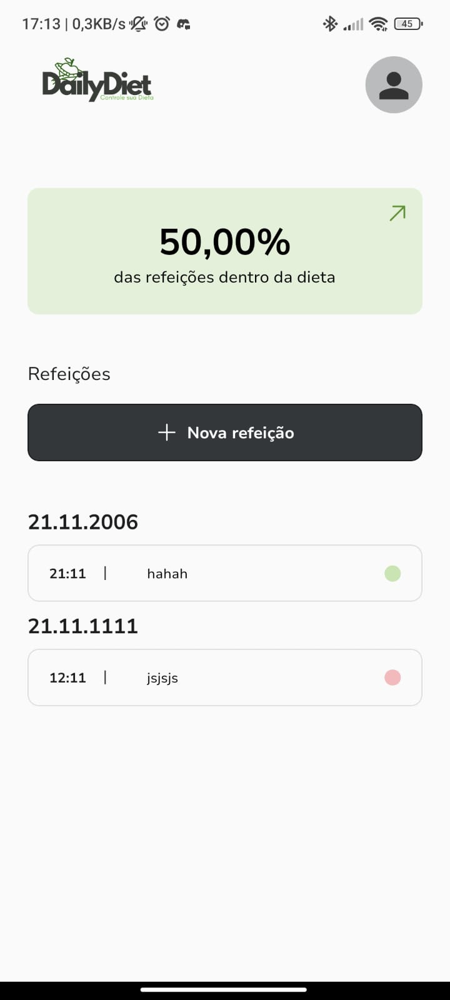

# DailyDiet

DailyDiet é um aplicativo que permite aos usuários registrarem suas refeições e acompanharem seu progresso em relação às metas alimentares. Este projeto é baseado em um desafio prático da **Rocketseat**, mas foi profundamente modificado para explorar novas ferramentas e conceitos no desenvolvimento mobile.

## Imagens ilustrativas do projeto

  
  
  
  
  
  

## Tecnologias Utilizadas

O projeto utiliza um conjunto de tecnologias modernas para garantir desempenho, manutenção e escalabilidade:

- **React Native CLI**: Substitui o Expo para maior controle sobre a parte nativa do desenvolvimento.
- **Restyle**: Uma biblioteca poderosa para estilização que oferece uma abordagem tipada e integrada.
- **MMKV**: Utilizado para armazenamento de dados, garantindo alta performance.
- **Zustand**: Para gerenciamento de estado simples e eficiente.

## Funcionalidades

- Registro de refeições com detalhes como nome, descrição e horário.
- Classificação de refeições como dentro ou fora da dieta.
- Feedback visual do progresso do usuário em relação às metas.
- Histórico detalhado de refeições.
- Interface intuitiva e moderna.

## Objetivos do Projeto

O DailyDiet foi desenvolvido com o intuito de:

1. Explorar o uso do React Native CLI e aprofundar conhecimentos na parte nativa do desenvolvimento mobile.
2. Implementar uma solução de armazenamento de dados performática com o MMKV.
3. Experimentar a estilização baseada em tema com o Restyle.
4. Evoluir como desenvolvedor mobile ao aplicar boas práticas de desenvolvimento.

